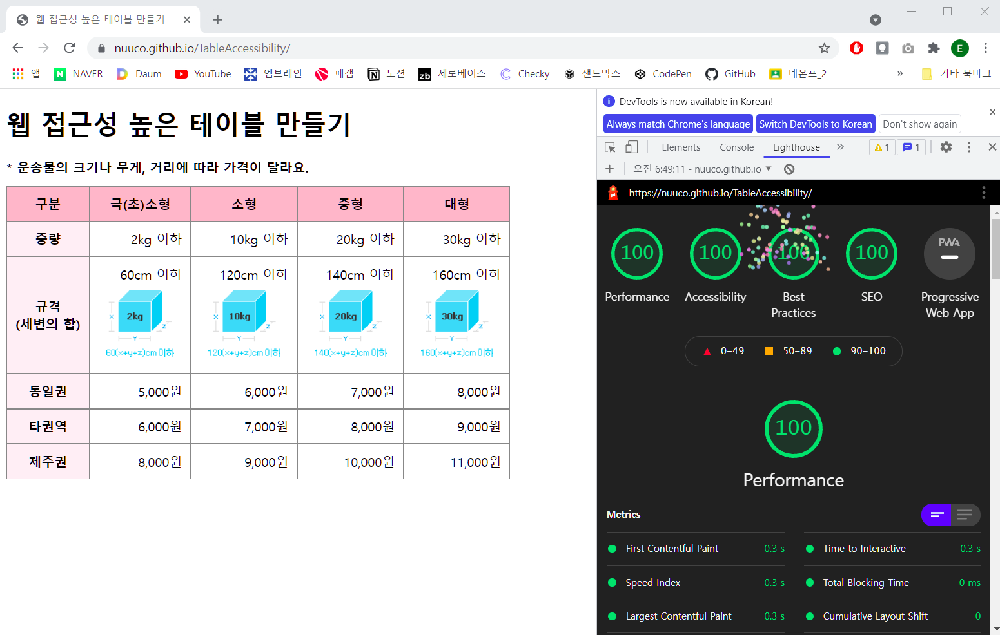

# 접근성 높은 데이터 테이블을 제작하기

## 1) 접근성이 좋지 않은 테이블이 있는 웹페이지를 선정
> 접근성이 좋지 않은 테이블 사이트 예시  
https://easylaw.go.kr/CSP/CnpClsMain.laf?popMenu=ov&csmSeq=663&ccfNo=2&cciNo=2&cnpClsNo=2  
(찾기 쉬운 생활 법령 정보)  

사이트 원본 테이블

  

## 2) 웹접근성 관련 조사 및 체크리스트 작성(테이블 위주)
<i style="color:gray">* 이 파트는 원래 4번째 이지만, 설명하기 쉽도록 순서를 변경했습니다.</i>  

### 기본적인 웹접근성 관련 팁
1. 가능한 단순하게 유지하기   
    복잡한 테이블은 하나의 하위 주제로 다시 묶어 간단한 개별 테이블로 나누자.

2. 표 분리하기  
    주제가 바뀌면 `<table>`을 새로 시작하자.  스크린 리더는 `<th>`열의 모든 셀을 소리내어 읽기 때문에 혼동을 일으킬 수 있다.

3. 데이터 분리하기
    * 한 셀 안에 하나의 데이터만 넣자. 
    * ` ` 등 줄바꿈(요소)로 행을 생성하지 말자.  
    * 한 셀 안에 여러 데이터를 넣으면 스크린 리더가 셀간 데이터 관계를 파악할 수 없다.

4. 정렬
    * 텍스트 데이터는 왼쪽 정렬 권장
    * 숫자 데이터는 오른쪽 정렬 권장
    * 같은 열의 데이터는 같은 방향 정렬 권장  

5. `<th>` 설정
    * 제목셀에 `<td>`가 아닌 `<th>`를 설정해주자.
    * th에는 td 와 구분되는 스타일링을 넣어주자.
    * 표에서 제목과 내용을 구분하려는 용도.

6. 얼룩말 표 
    * 행 수가 길어질 경우, 짝수 행과 홀수 행을 다르게 스타일 지정
    * 읽기에 어려움이 있거나 텍스트를 확대하는 사람들에게 도움이 된다. 시각적 안내자 역할. 

7. 유연성(주로 모바일 환경)
    * 사용자가 확대할 때 테이블이 잘리지 않도록 하자.  

8. 레이아웃용 테이블  
    레이아웃용으로 테이블을 쓰지 말자.  
    테이블 대신 CSS(Cascading Style Sheets)를 쓰자.

 

### 주로 체크할 내용(테이블 작성 시 자주 빠뜨리는 내용)
1. caption (summury)  
    *  table 내용의 제목 또는 간단한 요약을 `<caption>` 태그로 적어준다.
    * 한 테이블에 대해 캡션과 요약이 모두 제공되는 경우 요약은 캡션에 있는 정보와 중복되어서는 안 된다.
    * table의 summury 속성은 HTML5 부터는 비표준이 되었다. 그러니 가능하면 `<caption>` 태그로 설명을 넣어주자.
    * caption 태그는 table 태그의 첫번째 자식 요소로 위치해야한다.
    * caption 태그의 내용을 노출시키지 않고, 스크린 리더만 읽게 해주고 싶을 때는 <code>text-indent: -9999px</code> 로  안 보이게 처리한다.

2. thead, tbody, tfoot  
    * `<thead>` : 제목행 표현
    * `<tbody>` : 본문내용의 그룹화, 여러 개 있을 수 있다.
    * `<tfoot>` : 표의 결과, 없는 경우도 있음.
    * thead, tfoot 요소의 장점?   
        * 웹페이지의 테이블의 데이터가 매우 많은 경우, 인쇄할 때 여러 장에 걸쳐 출력할 때 페이지마다 테이블의 thead, tfoot 정보를 인쇄할 수 있다.  
        * `<tfoot>` 이 더 중요하다면 `<tfoot>` 이 `<tbody>` 보다 위에 있을 수 있다. 이 경우 화면 출력은 동일하나, 소리 출력(스크린 리더)은 `<tfoot>`이 먼저 나온다. 이 경우, 순차적으로 콘텐츠에 접근하는 시각 장애인의 경우에는 점수 통계 및 결과 같은 테이블 종합 정보를 일일이 모든 셀의 데이터를 다 읽지않아도 먼저 알 수 있다.

3. scope 또는 headers   
    * 스크린 리더를 이용하는 사용자의 경우, 왼쪽에서 오른쪽으로 읽어주는 셀의 내용만 듣고 판단하기 때문에 열과 행을 파악하거나 내용 셀의 연관성을 유추하는 것이 어렵다.  
    이러한 경우에는 테이블의 열과 행의 제목 셀에 해당하는 `<th>` 요소에 scope 속성을 사용할 것이 권장된다.
    * `<th>` 가 열에 관련된 제목인 경우 <code>scope="col"</code>  
    행에 관련된 제목인 경우 <code>scope="row"</code>
    열 그룹에 관련된 경우 "colgroup", 행 그룹에 관련된 경우 "rowgroup"을 써준다.
    * 제목 셀이 복잡한 경우 (한 셀을 여러 제목셀이 가리키고 있는 경우), 데이터를 담고있는 `<td>` 태그에 headers라는 속성을 넣어주기도 한다. 이 때 headers에는 자신을 가리키는 `<th>`의 id 값을 넣는다.

> 테이블 웹 접근성 체크리스트
> (주요 체크)
> - [ ] `<caption>` 으로 테이블의 설명을 써줬는가? 태그 위치는 올바른가?
> - [ ] 

  

## 3) 웹표준 준수 및 웹접근성 관점에서 기존 서비스의 문제점 분석

  

## 4) 해상 이슈를 WCAG 가이드라인에 맞춰 수정 계획 선정

  

## 5) HTML/CSS를 활용하여 구현(자바스크립트는 선택사항)
[테이블 구현 코드 : index.html](./index.html)

  

## 6) 문법 검사 결과 제출
<a href="https://validator.w3.org/#validate_by_upload" target="_blank">W3C validator</a> 를 이용한 문법 검사 결과

  

## 7) 라이트하우스에서 접근성 및 SEO 관련 분석 리포트 제출
report/Lighthouse_report.pdf 파일 참고  
[라이트하우스 보고서](./report/Lighthouse_report.pdf)

  

## 8) 프로젝트 완료 후기(시행착오 및 성장기)
